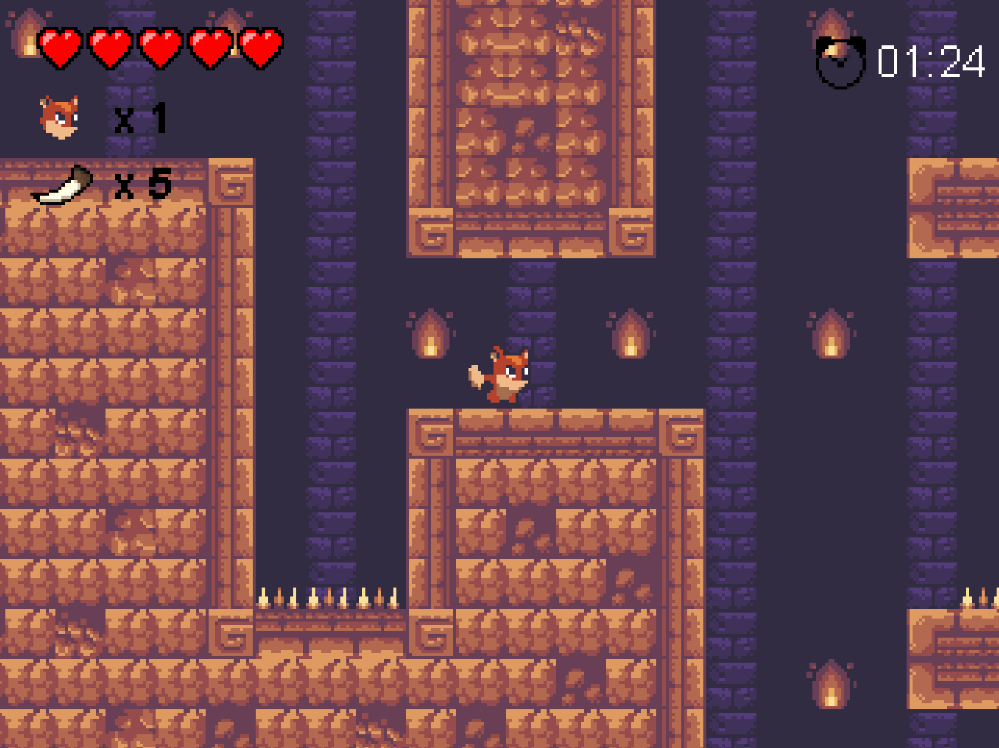

# Wandering Fox Adventure
> Final Project mata kuliah PBO (Pemograman Berbasis Objek) kelas E

## Dibuat Oleh :
1. Jericho Nathanael Chrisnanta. - 5025221001
2. Muhammad Bimatara Indianto - 5025221260

## Deskripsi Game
Game platformer yang terinspirasi dari Super Mario Bros di mana tujuan dari game ini adalah menyelesaikan level dengan melewati rintangan. Ada pula cerita yang kami angkat adalah Di game “Wandering Fox Adventure”, player akan bermain sebagai Natsume si rubah kecil. Hidup dalam hutan yang subur, Natsume tiba-tiba kehilangan ibunya akibat serangan makhluk misterius. Dengan hati penuh kesedihan dan tekad, Natsume memulai pencarian tak terlupakan untuk menemukan ibunya yang hilang. Dalam perjalanan epiknya, Natsume akan melewati hutan yang luas dan gua yang mengerikan Ia juga akan berhadapan dengan berbagai monster misterius. Apakah Natsume akan berhasil menyelesaikan petualangannya.

## Menu Screen 

## Level 1 Screen

## Level 2 Screen 

## Final Stage
Try our game to find out the final stage

## Referensi
- [Tutorial Pembuatan Game Platformer](https://www.youtube.com/playlist?list=PL-2t7SM0vDfcIedoMIghzzgQqZq45jYGv)
- [Sunny Land](https://ansimuz.itch.io/sunny-land-pixel-game-art)